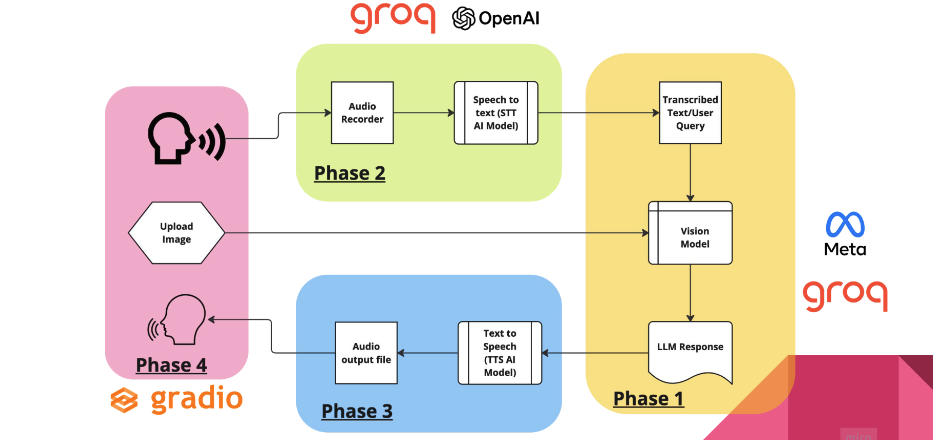
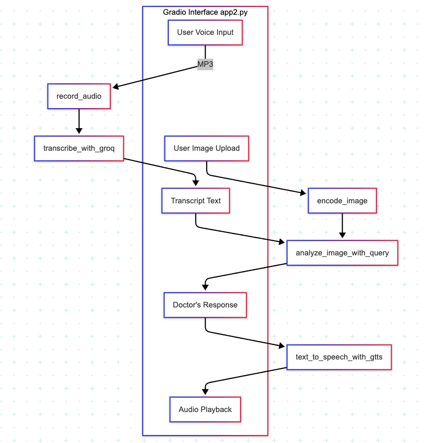

# ImageTalk

## Architecture Diagram

## Project Overview

This project is a **multimodal AI assistant** that combines **speech recognition**, **image understanding**, and **text generation** to simulate a medical consultation. It allows a user (patient) to:

- Speak symptoms via microphone
- Upload a medical image (e.g., an X-ray)
- Get a text and audio response that simulates a doctor’s diagnosis

Built with:
- **Groq’s ultra-fast LLM API** (Whisper for STT, LLaMA for multimodal reasoning)
- **Gradio** for a clean user interface
- **Google Text-to-Speech (gTTS)** for natural audio feedback

---

## Tech Stack

| Feature               | Technology Used                                      |
|----------------------|------------------------------------------------------|
| Voice Recording       | `speech_recognition`, `pydub`, `microphone`         |
| Speech-to-Text (STT)  | `whisper-large-v3` via `Groq API`                   |
| Image Encoding        | `base64`, JPEG format                               |
| Multimodal Reasoning  | `meta-llama/llama-4-scout-17b-16e-instruct` via Groq|
| Text-to-Speech (TTS)  | `gTTS` (Google Text-to-Speech)                      |
| UI                    | `Gradio`                                            |

---

## Code File Breakdown

### `brain.py`
Handles **image + text-based querying** of Groq’s multimodal LLM.

- `encode_image(image_path)` — Converts image to base64.
- `analyze_image_with_query(query, model, encoded_image)` — Sends a text + image prompt to Groq and retrieves a generated medical response.

---

### `patient_voice.py`
Handles **user voice input and transcription**.

- `record_audio(file_path)` — Records microphone input and saves as MP3.
- `transcribe_with_groq(stt_model, audio_filepath)` — Sends the audio file to Groq’s Whisper model and returns the transcribed text.

---

### `ai_voice.py`
Handles **Text-to-Speech (TTS)** and **audio playback**.

- `text_to_speech_with_gtts(input_text, output_filepath)` — Uses `gTTS` to convert text into an MP3 and plays it using OS-specific utilities (`afplay`, `aplay`, or PowerShell).

---

### `app2.py`
Main application file that **ties everything together** using a Gradio interface.

- Calls functions from `brain.py`, `patient_voice.py`, and `ai_voice.py`
- Accepts:
  - An **audio recording** from the user
  - An **optional medical image**
- Displays:
  - Transcribed text
  - AI-generated diagnosis
  - Audio playback
- Includes a `Save` button to store both the text and the generated voice as a `.txt` and `.mp3` file.

---

## How the Code Files Work Together

